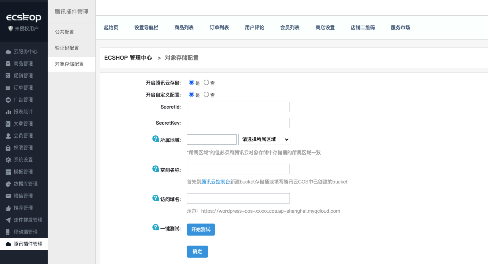
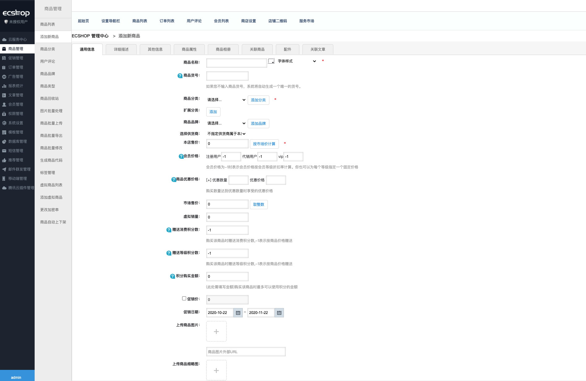

# 腾讯云对象存储

## 1.插件介绍

> 腾讯云对象存储实现网站静态媒体资源与腾讯云COS的互通，有效降低本地存储负载，提升用户访问网站媒体资源的体验。

| 标题       | 内容                                                         |
| ---------- | ------------------------------------------------------------ |
| 中文名称   | 腾讯云对象存储扩展                                         |
| 最新版本   | v1.0.0 (2020.09.27)                                           |
| 适用平台   | [ECSHOP](https://www.ecshop.com/) 
| 适用产品   | [腾讯云对象存储（COS）](https://cloud.tencent.com/product/cos)      |
| 主创团队   | 腾讯云中小企业产品中心（SMB Product Center of Tencent Cloud）   

## 2.功能特性
- 新增商品时支持将商品图片，商品缩略图，商品详情中的图片上传到腾讯云cos中存储
- 商品展示时，商品的相关图片从腾讯云cos中获取
- 删除商品时，腾讯云存储中与商品关联的图片也会同步删除

## 3.安装指引

### 3.1.部署方式一：通过GitHub部署安装
腾讯云对象存储功能兼容的ECShop版本：v4.0.7 RELEASE 20200102
> 1. git clone https://github.com/Tencent-Cloud-Plugins/tencentcloud-ecshop-plugin-cos.git，仓库中的代码包含腾讯验证码功能和对象存储功能，安装后可选中是否开启。
> 2. 将tencentcloud-captcha/ecshop文件夹中相关文件的代码合并到源码中对应文件中，推荐使用代码比较工具（Beyoned Compare）进行代码合并
- **修改说明1**：ecshop/js/目录中加入腾讯云验证码依赖的TCaptcha.js文件
> 1. /ecshop/tencentcloud_captcha/ecshop/js/TCaptcha.js
- **修改说明2**：加入腾讯云对象存储和验证码接口的依赖库
> 1. /ecshop/includes/cls_tencentcloud_captcha.php
> 2. /ecshop/includes/cls_tencentcloud_center.php
> 3. /ecshop/includes/cls_tencentcloud_cos.php
> 4. /ecshop/includes/tencent_cloud整个目录
- **修改说明3**：修改验证码管理页面相关文件
> 1. /ecshop/admin/templates/captcha_manage.htm
> 2. /ecshop/admin/captcha_manage.php
- **修改说明4**：添加腾讯云插件管理菜单及对象存储和验证吗配置页面
> 1. /ecshop/admin/includes/inc_icon.php
> 2. /ecshop/admin/includes/inc_menu.php
> 3. /ecshop/admin/includes/inc_priv.php
> 4. /ecshop/admin/templates/tencent_captcha.htm
> 5. /ecshop/admin/templates/tencent_center.htm
> 5. /ecshop/admin/templates/tencent_cos.htm
> 6. /ecshop/admin/tencent_captcha.php
> 7. /ecshop/admin/tencent_center.php
> 7. /ecshop/admin/tencent_cos.php
- **修改说明5**：后台登录页面腾讯云验证码功能代码修改
> 1. /ecshop/admin/templates/login.htm
> 2. /ecshop/admin/privilege.php
- **修改说明6**：登录、注册、商品评价、留言时验证码功能相关代码修改
> 1. /ecshop/user.php
> 2. /ecshop/comment.php
> 3. /ecshop/themes/default/user_clips.dwt
> 4. /ecshop/themes/default/user_passport.dwt
> 5. /ecshop/themes/default/library/comments_list.lbi
> 6. /ecshop/includes/lib_insert.php
> 7. /ecshop/includes/lib_main.php
- **修改说明7**：商品新增修改上传时对图片的远程存储操作
> 1. /ecshop/goods.php
> 2. /ecshop/admin/goods.php
> 3. /ecshop/admin/includes/lib_goods.php
> 4. /ecshop/includes/lib_goods.php
> 5. /ecshop/includes/fckeditor/editor/filemanager/connectors/php/commands.php
- **修改说明8**：商品展示模板
> 1. /ecshop/admin/templates/goods_info.htm
- **修改说明9**：语言文件修改(简体中文、繁体中文、英文)
> 1. /ecshop/languages/zh_cu/admin/captcha_manage.php
> 2. /ecshop/languages/zh_cu/admin/common.php
> 3. /ecshop/languages/zh_cu/admin/tencent_captcha.php
> 4. /ecshop/languages/zh_cu/admin/tencent_center.php
> 5. /ecshop/languages/zh_cu/admin/users.php
> 6. /ecshop/languages/zh_cu/user.php
> 7. /ecshop/languages/zh_cu/admin/tencent_cos.php
## 4.使用指引

### 4.1. 页面功能介绍

> 腾讯云对象存储配置页面，填写正确的配置信息后点击"开始测试"，测试成功后点"确定"保存配置。

> 在后台的"商品管理"->"添加商品"页面中上传商品图片、上传商品缩略图以及在"详细描述"中上传图片和在"商品相册"中上传图片。
> 有且仅有以上四种场景上传的附件会存储到腾讯云的存储桶中。

### 4.2. 名词解释
- **自定义密钥**：插件提供统一密钥管理，既可在多个腾讯云插件之间共享SecretId和SecretKey，也可为插件配置单独定义的腾讯云密钥。
- **SecretId**：在腾讯云云平台API密钥上申请的标识身份的 SecretId。详情参考[腾讯云文档](https://cloud.tencent.com/document/product)
- **SecretKey**：在腾讯云云平台API密钥上申请的标识身份的SecretId对应的SecretKey。详情参考[腾讯云文档](https://cloud.tencent.com/document/product)
- **所属地域**：在腾讯云服务器所在地域。详情参考[腾讯云文档](https://cloud.tencent.com/document/product/457/44232)
- **空间名称**：COS服务中存储桶的名称。详情参考[腾讯云文档](https://cloud.tencent.com/document/product/436/41153)
- **访问域名**：存储桶的访问域名。详情参考[腾讯云文档](https://cloud.tencent.com/document/product/436/6224)

## 5.FAQ
- **问题1**：开启腾讯云对象存储后上传商品的图片且成功，但是在页面中无法正常显示图片？
> 检查"访问域名"是否填写正确

- **问题2**：开启腾讯云对象存储后，之前上传商品的图片无法正常显示图片？
> 需要你手动上传历史商品图片到空间名称所做的存储桶中。附件在存储桶中的路径和附件在本地的'/ecshop/'目录下的相对路径一致。
> 可使用[工具概览](https://cloud.tencent.com/document/product/436/6242)中介绍的上传工具上传附件。

- **问题3**：开启腾讯云对象存储后，批量上传商品的图片无法正常显示图片？
> 需要你手动上传批量上传的商品图片到空间名称所做的存储桶中。附件在存储桶中的路径和附件在本地的'/ecshop/'目录下的相对路径一致。
> 可使用[工具概览](https://cloud.tencent.com/document/product/436/6242)中介绍的上传工具上传附件。
## 6.GitHub版本迭代记录

### 6.1 tencentcloud-ecshop-plugin-cos v1.0.0

- 新增商品时支持将商品图片，商品缩略图，商品详情中的图片上传到腾讯云cos中存储
- 商品展示时，商品的相关图片从腾讯云cos中获取
- 删除商品时，腾讯云存储中与商品关联的图片也会同步删除